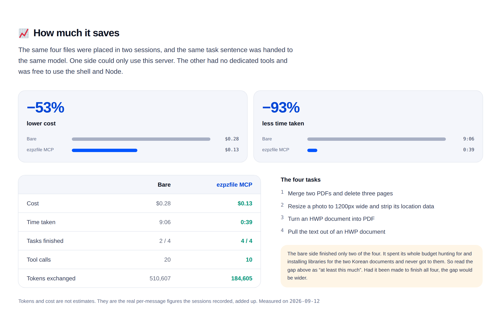

# ezpzfile-mcp

File tools for AI agents. Read and convert documents (HWP, HWPX, DOCX, PDF, EML),
edit PDFs, resize and clean images, cut out backgrounds, make QR codes. Everything
runs on your machine and no file is ever uploaded.

```bash
claude mcp add ezpzfile -- npx -y ezpzfile-mcp
```

[npm](https://www.npmjs.com/package/ezpzfile-mcp) · [ezpzfile.com/mcp](https://ezpzfile.com/mcp) · Node 20 or newer

## What it saves

The same four files were placed in two sessions and the same task sentence was
handed to the same model. One side could only use this server. The other had no
dedicated tools and was free to use the shell and Node.

| | Without tools | With ezpzfile-mcp |
|---|---|---|
| Cost | $0.28 | **$0.13** |
| Wall time | 9:06 | **0:39** |
| Tasks finished | 2 / 4 | **4 / 4** |
| Tool calls | 20 | **10** |
| Tokens | 510,607 | **184,605** |

That is 53% less cost and 93% less time. Tokens and cost are not estimates; they
are the per-message figures the sessions recorded, added up. Measured 2026-09-12.

The bare session never started two of the tasks. It spent the clock hunting for and
installing libraries for the two Korean documents. Read the gap as a floor, not a
ceiling: had it been made to finish all 4, the difference would be wider.



## The tools

Six of them, not twenty five. Tool definitions sit in the model's context for every
conversation, so related jobs share one tool and an argument picks between them.
[`mcp/README.md`](./mcp/README.md) has the full list and every argument.

| Tool | What it does |
|---|---|
| `doc_read` | Text out of HWP, HWPX, DOCX, PDF and EML, tables included |
| `doc_convert` | Documents to PDF, Korean formats to each other, PDF pages to images, sheets to CSV or JSON |
| `pdf_edit` | Merge, extract, delete, rotate, reorder, split, compress, protect, unlock |
| `pdf_info` | Page count, page sizes, encryption, metadata |
| `image_edit` | Resize, compress, convert, strip EXIF and GPS, cut out the background |
| `qr_make` | A link or some text as a PNG or SVG |

## Layout

| Path | What it is |
|---|---|
| [`mcp/`](./mcp) | The package: server, tools, build |
| `src/lib/` | Code shared with [ezpzfile.com](https://ezpzfile.com) |
| `public/vendor/` | The HWP engine and the fonts embedded into generated PDFs |

```bash
cd mcp
npm install
npm run build      # writes mcp/dist/index.js and mcp/vendor/
node test/protocol.mjs /path/to/samples
```

`sharp` and `@napi-rs/canvas` are native, so they are built for your platform on
install. Background removal downloads a 4.4MB model and a 14MB runtime the first
time you ask for a cut-out, then caches them under `~/.cache/ezpzfile-mcp`. That is
the only thing here that touches the network, and it uploads nothing.

## A note on this repository

This is a read-only export. The working copy lives in a private monorepo alongside
the website, and this repository is regenerated from it on each release. Please open
issues rather than pull requests.

MIT licensed, see [LICENSE](./LICENSE).
